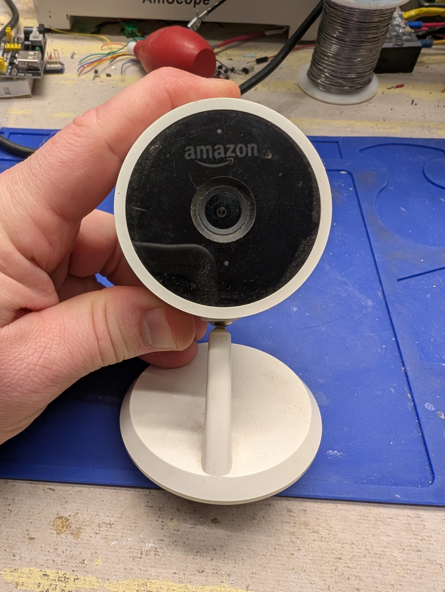
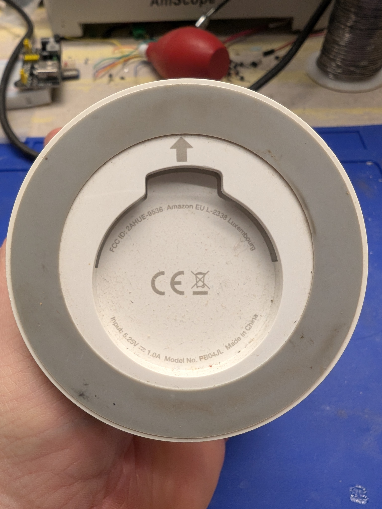
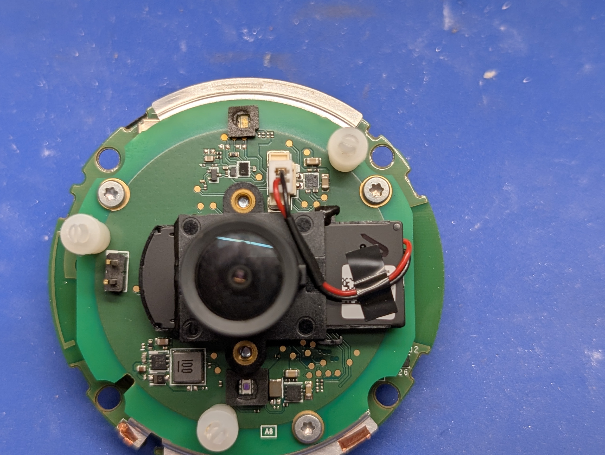
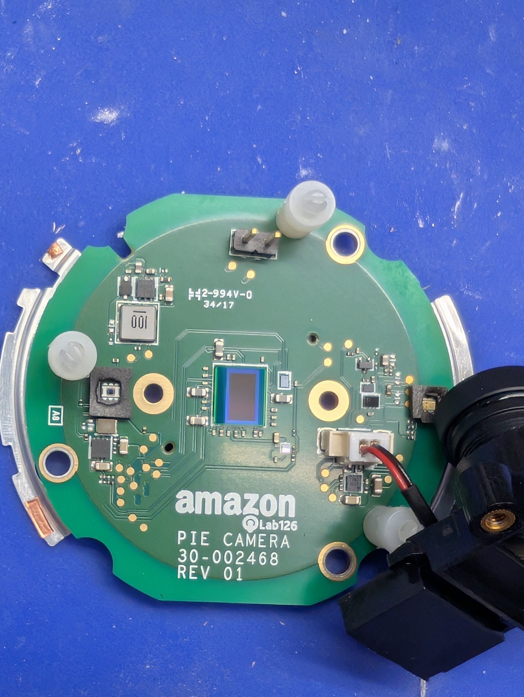
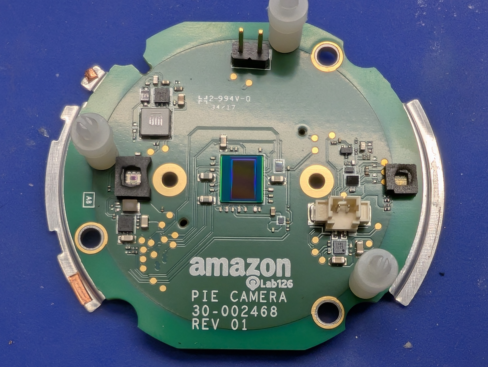
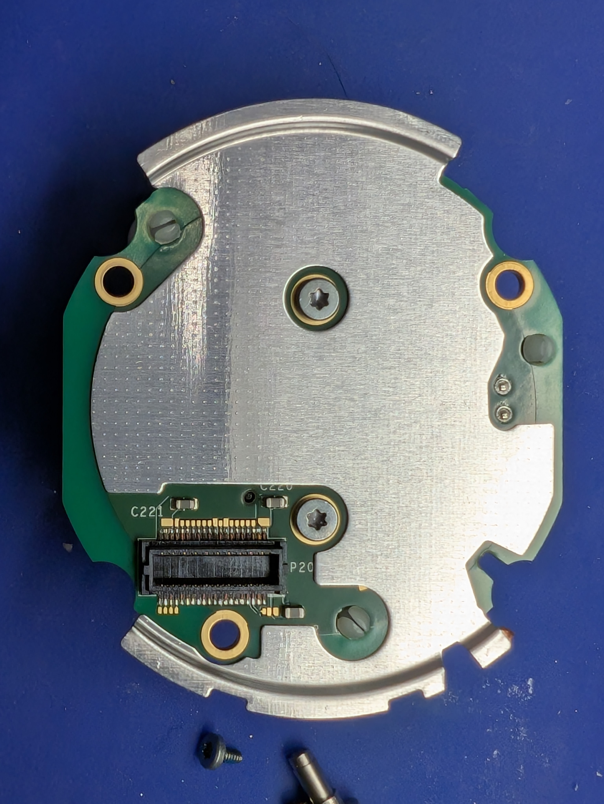

# Amazon CloudCam PB40JL





## Checklist

- [x] Reference materials
    - [n/a] Manufacturer docs
    - [n/a] Firmware updates
    - [n/a] OpenWRT support
    - [n/a] Pinouts
- [ ] Factory reset
- [x] External documentation
- [x] Case opened
- [x] Internal documentation
- [ ] Dumped ROM .reset
- [ ] Extracted FW parts, inspected
- [ ] Factory reset with boot
- [ ] Dumped ROM regular
- [ ] Booted
- [ ] Root shell
- [ ] Pull stats
    - [ ] `uname -a`
    - [ ] `busybox --help`
    - [ ] `cat /proc/mtd`

## Critical Info

External label:

```text
Input: 5.25V DC 1.0 A
Model No. PB04JL
```

## Reference material:

* [Product Link]()
* [Firmware update]()
* [Open firmware]()


## Inside

Opening

## Opening

(Screws?)

## Mainboard

Markings:

```text

```

### Chip

(photo)

Package

```text
Markings
```

## Amazon Lab126 PIE CAMERA board

Markings:
```text
amazon
   Lab126
PIE CAMERA
30-002468
REV 01
```









### Chip

(photo)

Package:

Markings:

```text
```

[Datasheet]

Description (source):


## Firmware


## Conclusion: ?
